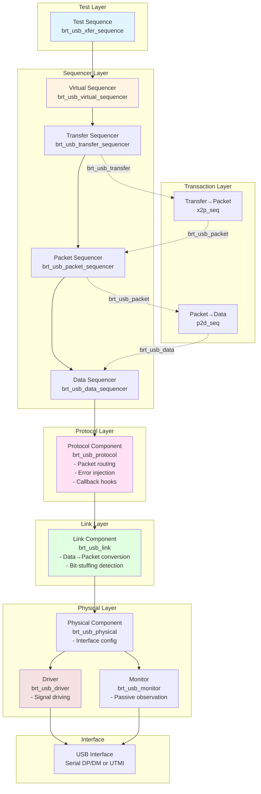
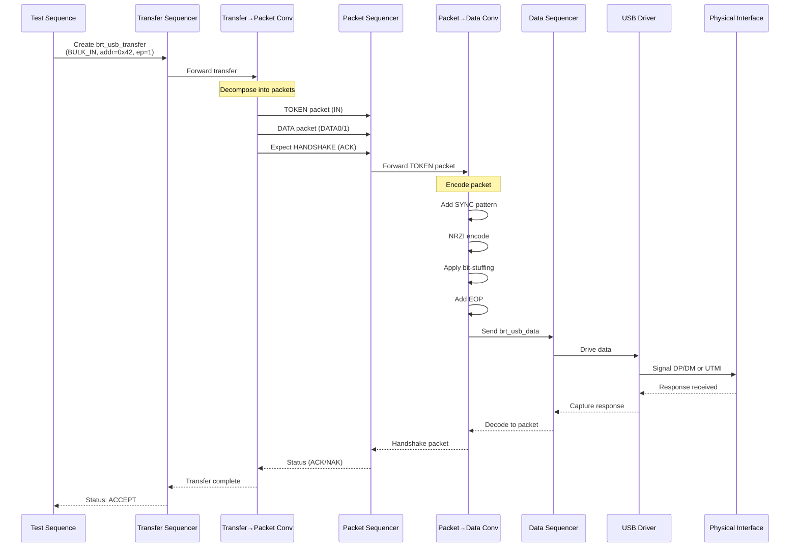
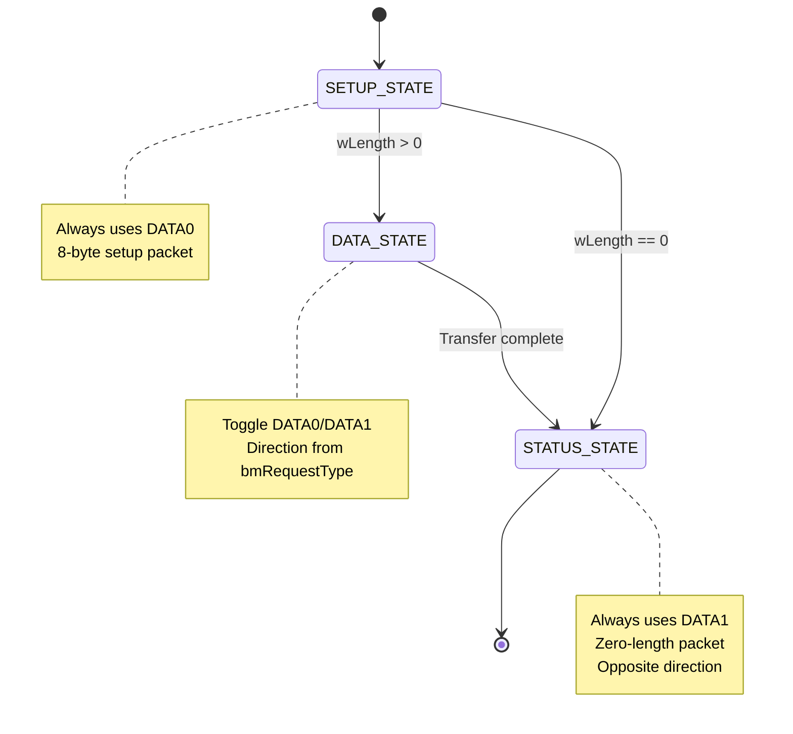
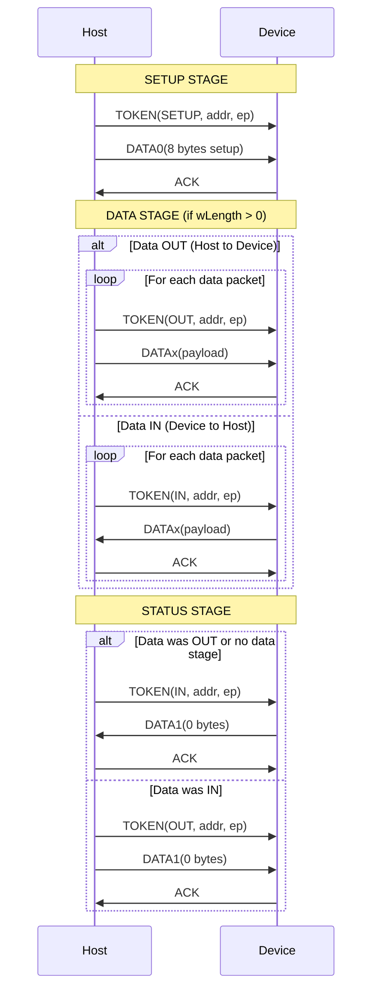
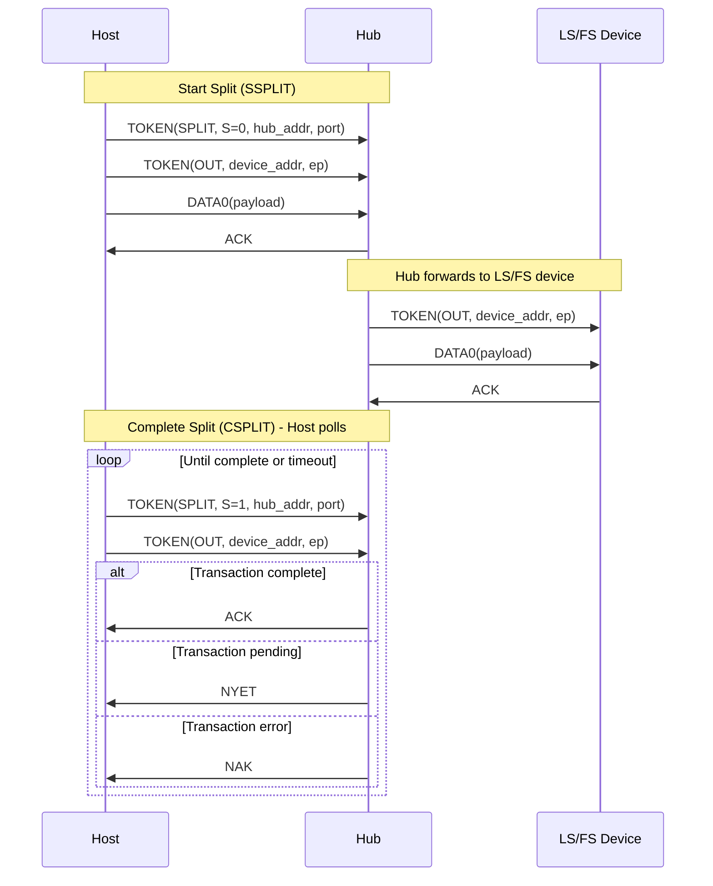
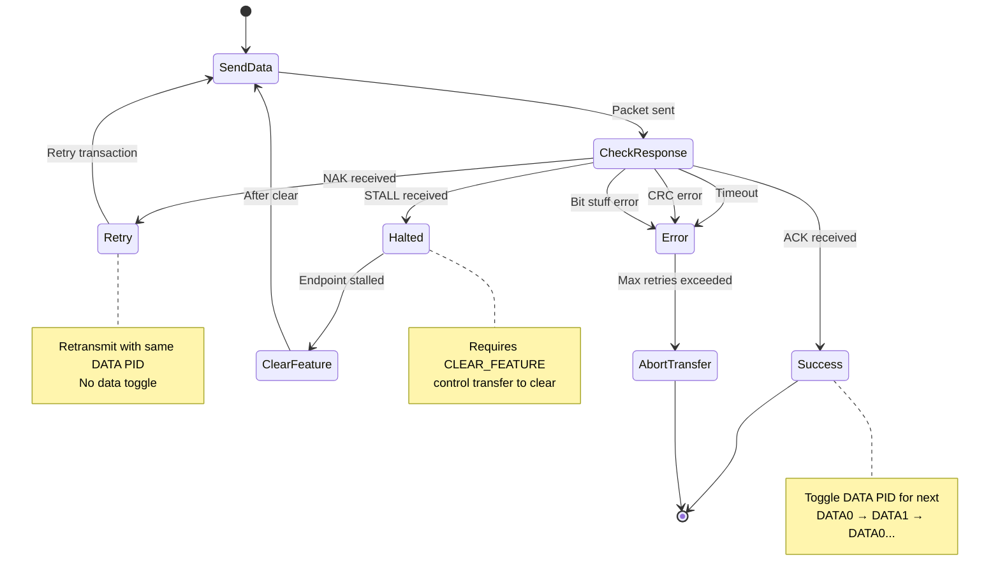

# USB VIP Transaction Flow Visualization

This document provides comprehensive visualizations of the transaction flow in the USB 2.0 Verification IP.

## Table of Contents
1. [Transaction Hierarchy](#transaction-hierarchy)
2. [Layered Architecture](#layered-architecture)
3. [Complete Transaction Flow](#complete-transaction-flow)
4. [Component Architecture](#component-architecture)
5. [Transaction Type Flows](#transaction-type-flows)
6. [Sequence Diagrams](#sequence-diagrams)

---

## Transaction Hierarchy

The USB VIP uses a 4-layer transaction hierarchy:

```
┌─────────────────────────────────────────────────────────────┐
│                    APPLICATION LAYER                         │
│                                                              │
│              brt_usb_transfer (High-Level)                   │
│  ┌──────────────────────────────────────────────────────┐  │
│  │ Transfer Type: CONTROL, BULK_IN, BULK_OUT, etc.     │  │
│  │ Device Address: 0x00-0x7F                           │  │
│  │ Endpoint: 0-15                                       │  │
│  │ Payload: Data bytes + byte count                    │  │
│  │ Setup Data: bmRequestType, bRequest, wValue, etc.   │  │
│  │ Status: INITIAL → RUNNING → ACCEPT/RETRY/ABORTED    │  │
│  └──────────────────────────────────────────────────────┘  │
└──────────────────────────┬───────────────────────────────────┘
                           │ Decompose
┌──────────────────────────▼───────────────────────────────────┐
│                     PROTOCOL LAYER                           │
│                                                              │
│                brt_usb_packet (Mid-Level)                    │
│  ┌──────────────────────────────────────────────────────┐  │
│  │ PID Types:                                           │  │
│  │  - TOKEN: OUT, IN, SOF, SETUP, PING                 │  │
│  │  - DATA: DATA0, DATA1, DATA2, MDATA                 │  │
│  │  - HANDSHAKE: ACK, NAK, STALL, NYET                 │  │
│  │  - SPECIAL: PRE_ERR, SPLIT, EXT, LPM                │  │
│  │ Fields: Function addr, endpoint, frame#, CRC5/16    │  │
│  │ Error Flags: pid_err, crc5_err, crc16_err           │  │
│  └──────────────────────────────────────────────────────┘  │
└──────────────────────────┬───────────────────────────────────┘
                           │ Encode
┌──────────────────────────▼───────────────────────────────────┐
│                       LINK LAYER                             │
│                                                              │
│                  brt_usb_data (Low-Level)                    │
│  ┌──────────────────────────────────────────────────────┐  │
│  │ NRZI Encoded Data Queue                              │  │
│  │ Bit-Stuffing Applied                                 │  │
│  │ Sync Pattern: 0x80 (LS/FS) or 0x80000001 (HS)      │  │
│  │ EOP Pattern: SE0 for 2 bit-times + J-state          │  │
│  │ Encoding/Decoding Functions                          │  │
│  └──────────────────────────────────────────────────────┘  │
└──────────────────────────┬───────────────────────────────────┘
                           │ Drive
┌──────────────────────────▼───────────────────────────────────┐
│                     PHYSICAL LAYER                           │
│                                                              │
│          DP/DM Signals (Serial) or UTMI Interface            │
│  ┌──────────────────────────────────────────────────────┐  │
│  │ Serial Interface:                                    │  │
│  │  - DP/DM differential signaling                     │  │
│  │  - Speed-dependent bit timing                        │  │
│  │                                                       │  │
│  │ UTMI Interface:                                      │  │
│  │  - DataOut[7:0], TxValid, TxReady                   │  │
│  │  - DataIn[7:0], RxValid, RxActive, RxError          │  │
│  └──────────────────────────────────────────────────────┘  │
└──────────────────────────────────────────────────────────────┘
```

---

## Layered Architecture



---

## Complete Transaction Flow

### Host Transmission Flow



### Device Reception Flow

```mermaid
sequenceDiagram
    participant PHY as Physical Interface
    participant Mon as Monitor/Driver
    participant Link as Link Layer
    participant Prot as Protocol Layer
    participant D2P as Data→Packet Conv
    participant P2X as Packet→Transfer Conv
    participant Handler as Device Handler

    PHY->>Mon: Incoming DP/DM signals
    Note over Mon: Capture & decode
    Mon->>Mon: NRZI decode
    Mon->>Mon: Remove bit-stuffing
    Mon->>Mon: Detect SYNC & EOP

    Mon->>Link: Send brt_usb_data
    Link->>D2P: Forward data
    D2P->>D2P: Unpack to packet
    D2P->>D2P: Verify CRC5/16
    D2P->>D2P: Check PID

    D2P->>Prot: Send brt_usb_packet
    Prot->>Prot: Queue packet
    Prot->>Prot: Trigger callbacks<br/>(packet_monitor)

    Prot->>P2X: Forward packet
    P2X->>P2X: Assemble transfer
    P2X->>Handler: Complete transfer

    Note over Handler: Generate response
    Handler->>Prot: Response packet<br/>(ACK/NAK/DATA)
    Prot->>Link: Encode response
    Link->>Mon: Drive response
    Mon->>PHY: Transmit DP/DM
```

---

## Component Architecture

### USB Agent Hierarchy

```
brt_usb_agent
├── Configuration
│   ├── is_active (ACTIVE/PASSIVE)
│   ├── comp_type (HOST/DEVICE)
│   ├── has_monitor (TRUE/FALSE)
│   └── interface_type (SERIAL/UTMI)
│
├── Virtual Sequencer (virt_sequencer)
│   ├── xfer_sequencer          → Generates transfers
│   ├── brt_usb_20_pkt_sequencer → Generates packets
│   ├── brt_usb_20_data_sequencer → Generates data
│   ├── link_service_sequencer   → Link services
│   └── prot_service_sequencer   → Protocol services
│
├── Layering (ulayer)
│   ├── Sub-sequencers
│   │   ├── x2p_seq[16]        → Transfer→Packet (per endpoint)
│   │   ├── p2d_seq            → Packet→Data (host)
│   │   ├── d_x2p_seq[16]      → Device Transfer→Packet
│   │   ├── d_p2d_seq          → Device Packet→Data
│   │   └── sof_pkt_seq        → SOF generation
│   │
│   └── Monitors
│       ├── link_mon           → Data→Packet monitor
│       └── prot_mon           → Packet→Transfer monitor
│
├── Protocol Layer (prot)
│   ├── Packet queue
│   ├── Callback registry
│   │   ├── packet_monitor_cb
│   │   ├── pre_handshake_cb
│   │   ├── pre_data_ready_cb
│   │   └── pre_handshake_stall_cb
│   └── Analysis ports
│
├── Link Layer (link)
│   ├── Data→Packet conversion
│   ├── Bit-stuffing detection
│   └── CRC validation
│
├── Physical Layer (phys)
│   ├── Speed configuration (LS/FS/HS)
│   ├── Interface type (Serial/UTMI)
│   └── Timing parameters
│
├── Driver (udriver) - If ACTIVE
│   ├── Host mode driver
│   │   ├── sm_run_host_usb20_serial()
│   │   └── run_host_utmi()
│   └── Device mode driver
│       ├── sm_run_dev_brt_usb20_serial()
│       └── run_dev_utmi()
│
├── Monitor (mon) - If has_monitor
│   ├── Passive observation
│   └── Analysis port output
│
└── Status (shared_status)
    ├── Remote device status
    │   ├── Configuration
    │   ├── Interface state
    │   └── Endpoint status
    └── Local host status
        ├── Frame counter
        └── Transfer tracking
```

---

## Transaction Type Flows

### 1. Control Transfer Flow

Control transfers consist of 3 stages: SETUP, DATA (optional), and STATUS.

```
┌──────────────────────────────────────────────────────────────┐
│                     CONTROL TRANSFER                          │
└──────────────────────────────────────────────────────────────┘

SETUP Stage (Host→Device, always present)
┌─────────┐     ┌─────────┐     ┌─────────┐
│ TOKEN   │ --> │  DATA0  │ --> │   ACK   │
│ SETUP   │     │ 8 bytes │     │(Device) │
│ Addr,EP │     │ setup   │     │         │
└─────────┘     └─────────┘     └─────────┘

DATA Stage (Optional, direction from bmRequestType)
  OUT Direction (Host→Device):
  ┌─────────┐     ┌─────────┐     ┌─────────┐
  │ TOKEN   │ --> │  DATAx  │ --> │   ACK   │
  │  OUT    │     │ payload │     │(Device) │
  └─────────┘     └─────────┘     └─────────┘

  IN Direction (Device→Host):
  ┌─────────┐     ┌─────────┐     ┌─────────┐
  │ TOKEN   │ --> │  DATAx  │ --> │   ACK   │
  │   IN    │     │ payload │     │ (Host)  │
  │         │     │(Device) │     │         │
  └─────────┘     └─────────┘     └─────────┘

STATUS Stage (Direction opposite to DATA or IN if no DATA)
  If DATA was OUT or no DATA:
  ┌─────────┐     ┌─────────┐     ┌─────────┐
  │ TOKEN   │ --> │  DATA1  │ --> │   ACK   │
  │   IN    │     │ 0 bytes │     │ (Host)  │
  │         │     │(Device) │     │         │
  └─────────┘     └─────────┘     └─────────┘

  If DATA was IN:
  ┌─────────┐     ┌─────────┐     ┌─────────┐
  │ TOKEN   │ --> │  DATA1  │ --> │   ACK   │
  │  OUT    │     │ 0 bytes │     │(Device) │
  └─────────┘     └─────────┘     └─────────┘
```

**State Diagram:**


### 2. Bulk Transfer Flow (OUT)

```
┌──────────────────────────────────────────────────────────────┐
│                   BULK OUT TRANSFER                           │
│  (Host → Device, large data blocks, CRC protected)           │
└──────────────────────────────────────────────────────────────┘

Successful Transaction:
┌─────────┐     ┌─────────┐     ┌─────────┐
│ TOKEN   │ --> │  DATAx  │ --> │   ACK   │
│  OUT    │     │ payload │     │(Device) │
│ Addr,EP │     │ 8-512B  │     │         │
└─────────┘     └─────────┘     └─────────┘

Device Not Ready:
┌─────────┐     ┌─────────┐     ┌─────────┐
│ TOKEN   │ --> │  DATAx  │ --> │   NAK   │
│  OUT    │     │ payload │     │(Device) │
└─────────┘     └─────────┘     └─────────┘
    ↓
[Host retries later]

Device Stalled:
┌─────────┐     ┌─────────┐     ┌─────────┐
│ TOKEN   │ --> │  DATAx  │ --> │  STALL  │
│  OUT    │     │ payload │     │(Device) │
└─────────┘     └─────────┘     └─────────┘
    ↓
[Endpoint halted, needs CLEAR_FEATURE]

HS: PING Protocol (High Speed optimization)
┌─────────┐     ┌─────────┐
│ TOKEN   │ --> │   ACK   │  Device ready
│  PING   │     │(Device) │
└─────────┘     └─────────┘
    ↓
┌─────────┐     ┌─────────┐     ┌─────────┐
│ TOKEN   │ --> │  DATAx  │ --> │   ACK   │
│  OUT    │     │ payload │     │(Device) │
└─────────┘     └─────────┘     └─────────┘

        OR

┌─────────┐     ┌─────────┐
│ TOKEN   │ --> │   NAK   │  Device not ready
│  PING   │     │(Device) │
└─────────┘     └─────────┘
    ↓
[Try again later, no data wasted]
```

### 3. Bulk Transfer Flow (IN)

```
┌──────────────────────────────────────────────────────────────┐
│                    BULK IN TRANSFER                           │
│  (Device → Host, large data blocks, CRC protected)           │
└──────────────────────────────────────────────────────────────┘

Successful Transaction:
┌─────────┐     ┌─────────┐     ┌─────────┐
│ TOKEN   │ --> │  DATAx  │ --> │   ACK   │
│   IN    │     │ payload │     │ (Host)  │
│ Addr,EP │     │(Device) │     │         │
└─────────┘     └─────────┘     └─────────┘

Device No Data:
┌─────────┐     ┌─────────┐
│ TOKEN   │ --> │   NAK   │
│   IN    │     │(Device) │
└─────────┘     └─────────┘
    ↓
[Host polls again later]

Device Stalled:
┌─────────┐     ┌─────────┐
│ TOKEN   │ --> │  STALL  │
│   IN    │     │(Device) │
└─────────┘     └─────────┘

HS: NYET Response (High Speed)
┌─────────┐     ┌─────────┐     ┌─────────┐
│ TOKEN   │ --> │  DATAx  │ --> │  NYET   │
│   IN    │     │ payload │     │ (Host)  │
│         │     │(Device) │     │Not ready│
└─────────┘     └─────────┘     └─────────┘
    ↓
[Device has more data, host not ready to accept]
```

### 4. Interrupt Transfer Flow

```
┌──────────────────────────────────────────────────────────────┐
│                  INTERRUPT TRANSFER                           │
│  (Periodic, guaranteed latency, small packets)               │
└──────────────────────────────────────────────────────────────┘

Interrupt IN (Device → Host):
┌─────────┐     ┌─────────┐     ┌─────────┐
│ TOKEN   │ --> │  DATAx  │ --> │   ACK   │
│   IN    │     │ payload │     │ (Host)  │
│ Addr,EP │     │ ≤64B    │     │         │
└─────────┘     └─────────┘     └─────────┘

Interrupt OUT (Host → Device):
┌─────────┐     ┌─────────┐     ┌─────────┐
│ TOKEN   │ --> │  DATAx  │ --> │   ACK   │
│  OUT    │     │ payload │     │(Device) │
│ Addr,EP │     │ ≤64B    │     │         │
└─────────┘     └─────────┘     └─────────┘

Timing Characteristics:
  ┌────────┐        ┌────────┐        ┌────────┐
  │ Frame  │        │ Frame  │        │ Frame  │
  │   N    │        │  N+1   │        │  N+2   │
  └───┬────┘        └───┬────┘        └───┬────┘
      │                 │                 │
      ├─ SOF           ├─ SOF           ├─ SOF
      │                 │                 │
      ├─ INT xfer      ├─ INT xfer      ├─ INT xfer
      │   (bInterval)   │                 │

bInterval defines polling rate:
  - LS/FS: 1-255 frames (1ms each)
  - HS: 1-16 microframes (125μs each), encoded as 2^(bInterval-1)
```

### 5. Isochronous Transfer Flow

```
┌──────────────────────────────────────────────────────────────┐
│                 ISOCHRONOUS TRANSFER                          │
│  (Real-time, no retries, no handshake, time-critical)       │
└──────────────────────────────────────────────────────────────┘

Isochronous OUT (Host → Device):
┌─────────┐     ┌─────────┐
│ TOKEN   │ --> │  DATAx  │  [No handshake!]
│  OUT    │     │ payload │
│ Addr,EP │     │ 0-1023B │
└─────────┘     └─────────┘

Isochronous IN (Device → Host):
┌─────────┐     ┌─────────┐
│ TOKEN   │ --> │  DATAx  │  [No handshake!]
│   IN    │     │ payload │
│ Addr,EP │     │(Device) │
└─────────┘     └─────────┘

Error Handling:
  - No ACK/NAK/STALL
  - CRC errors detected but NOT retried
  - Missing data = silence (no packet)
  - Relies on higher layer error correction (e.g., audio codec)

Timing:
  ┌────────────┐  ┌────────────┐  ┌────────────┐
  │  Frame N   │  │ Frame N+1  │  │ Frame N+2  │
  │  (1ms)     │  │  (1ms)     │  │  (1ms)     │
  └─────┬──────┘  └─────┬──────┘  └─────┬──────┘
        │               │               │
        ├─ SOF          ├─ SOF          ├─ SOF
        │               │               │
        ├─ ISO          ├─ ISO          ├─ ISO
        │   guaranteed   │   guaranteed   │   guaranteed
        │   bandwidth    │   bandwidth    │   bandwidth

HS: Multiple transactions per microframe (High-Bandwidth)
  ┌──────────────────┐
  │  Microframe 125μs│
  ├──────────────────┤
  │  ISO transaction │
  │  ISO transaction │  Up to 3 per microframe
  │  ISO transaction │
  └──────────────────┘
```

### 6. LPM (Link Power Management) Transfer

```
┌──────────────────────────────────────────────────────────────┐
│              LPM (Link Power Management)                      │
│  (USB 2.0 Extension for power saving)                        │
└──────────────────────────────────────────────────────────────┘

LPM Transaction:
┌─────────┐     ┌─────────┐
│ TOKEN   │ --> │   ACK   │  Device accepts sleep
│  LPM    │     │(Device) │
│ HIRD,   │     │         │
│ RemWake │     │         │
└─────────┘     └─────────┘

        OR

┌─────────┐     ┌─────────┐
│ TOKEN   │ --> │  NYET   │  Device busy, try later
│  LPM    │     │(Device) │
└─────────┘     └─────────┘

        OR

┌─────────┐     ┌─────────┐
│ TOKEN   │ --> │  STALL  │  LPM not supported
│  LPM    │     │(Device) │
└─────────┘     └─────────┘

LPM Token Fields:
  - Device Address (7 bits)
  - Endpoint (must be 0)
  - HIRD: Host Initiated Resume Duration (4 bits)
  - RemoteWake: Remote wake enable (1 bit)
  - CRC5

State Transition:
┌────────┐   LPM(ACK)   ┌────────┐   Resume    ┌────────┐
│ Active │────────────> │  L1    │───────────> │ Active │
│        │              │ Sleep  │             │        │
└────────┘              └────────┘             └────────┘
                            │
                            │ Timeout
                            v
                        ┌────────┐
                        │  L2    │
                        │Suspend │
                        └────────┘
```

---

## Sequence Diagrams

### Complete Control Transfer (with all stages)



### Split Transaction (HS Hub with LS/FS Device)



### Error Recovery Flow



---

## Data Toggle Synchronization

```
┌──────────────────────────────────────────────────────────────┐
│               DATA TOGGLE MECHANISM                           │
│  (Ensures reliable data delivery with retries)               │
└──────────────────────────────────────────────────────────────┘

Normal Flow with Toggles:
Transaction 1:
┌─────────┐     ┌─────────┐     ┌─────────┐
│ TOKEN   │ --> │  DATA0  │ --> │   ACK   │  → Toggle to DATA1
│  OUT    │     │ payload │     │         │
└─────────┘     └─────────┘     └─────────┘

Transaction 2:
┌─────────┐     ┌─────────┐     ┌─────────┐
│ TOKEN   │ --> │  DATA1  │ --> │   ACK   │  → Toggle to DATA0
│  OUT    │     │ payload │     │         │
└─────────┘     └─────────┘     └─────────┘

Transaction 3:
┌─────────┐     ┌─────────┐     ┌─────────┐
│ TOKEN   │ --> │  DATA0  │ --> │   ACK   │  → Toggle to DATA1
│  OUT    │     │ payload │     │         │
└─────────┘     └─────────┘     └─────────┘


Error Scenario - Lost ACK:
Transaction 1:
┌─────────┐     ┌─────────┐     ┌─────────┐
│ TOKEN   │ --> │  DATA0  │ --> │   ACK   │  → ACK lost!
│  OUT    │     │ payload │     │ (lost)  │     Host doesn't toggle
└─────────┘     └─────────┘     └─────────┘
                                               Device toggles to DATA1

Host Retry (still DATA0):
┌─────────┐     ┌─────────┐     ┌─────────┐
│ TOKEN   │ --> │  DATA0  │ --> │   ACK   │  → Device sees DATA0,
│  OUT    │     │ payload │     │         │     knows it's retry,
└─────────┘     └─────────┘     └─────────┘     discards duplicate,
                                                 sends ACK


Toggle Reset Conditions:
1. SETUP token - Always followed by DATA0
2. Configuration change - Toggles reset to DATA0
3. Interface alternate setting change - Toggles reset to DATA0
4. Endpoint CLEAR_FEATURE(HALT) - Resets toggle to DATA0
```

---

## Frame and Microframe Structure

```
┌──────────────────────────────────────────────────────────────┐
│              USB FRAME STRUCTURE                              │
└──────────────────────────────────────────────────────────────┘

Full Speed / Low Speed (1ms frame):
┌────────────────────────────────────────────────────────────┐
│                      1ms FRAME                              │
├────────────────────────────────────────────────────────────┤
│ SOF │ Ctrl │ Bulk │ Int │ Ctrl │ Bulk │ Int │ Isoc │ Idle │
│     │ xfer │ xfer │xfer │ xfer │ xfer │xfer │ xfer │      │
└────────────────────────────────────────────────────────────┘
 ↑
 └── Frame number (11 bits, 0-2047)

SOF Packet:
┌─────────┬──────────────┬───────┐
│  SYNC   │   PID(SOF)   │  DATA │
├─────────┼──────────────┼───────┤
│ 8 bits  │   8 bits     │11+5bit│
│ 0x80    │   0xA5       │Frame# │
│         │              │+ CRC5 │
└─────────┴──────────────┴───────┘


High Speed (125μs microframe):
┌──────────────────────────────────────────────────────┐
│                    1ms FRAME                          │
├───────────┬───────────┬───────────┬──────────────────┤
│ μFrame 0  │ μFrame 1  │ μFrame 2  │   ... μFrame 7   │
│  (125μs)  │  (125μs)  │  (125μs)  │      (125μs)     │
└───────────┴───────────┴───────────┴──────────────────┘

Each microframe:
┌────────────────────────────────────────────────────┐
│              125μs MICROFRAME                       │
├────────────────────────────────────────────────────┤
│SOF│ Ctrl │ Bulk│ Int │ Bulk │ Int │ Isoc │ Idle   │
│   │(split)│xfer │xfer │ xfer │xfer │ xfer │        │
└────────────────────────────────────────────────────┘
 ↑
 └── Microframe number (3 bits, 0-7 within frame)


Bandwidth Allocation Priority:
1. Isochronous (up to 90% of frame)
2. Interrupt (remaining after ISO)
3. Control (guaranteed minimum)
4. Bulk (remaining bandwidth)
```

---

## Summary

This USB VIP implements a comprehensive 4-layer transaction model:

1. **Application Layer** (brt_usb_transfer): High-level USB operations
2. **Protocol Layer** (brt_usb_packet): USB packet types and sequencing
3. **Link Layer** (brt_usb_data): NRZI encoding and bit-stuffing
4. **Physical Layer**: DP/DM or UTMI interface signaling

The VIP supports all USB 2.0 transfer types (Control, Bulk IN/OUT, Interrupt IN/OUT, Isochronous IN/OUT, LPM) with proper error handling, data toggle synchronization, and split transaction support for mixed-speed environments.

---

**File Location:** `/home/user/apb_vip/TRANSACTION_FLOW_VISUALIZATION.md`
**Last Updated:** 2025-11-17
